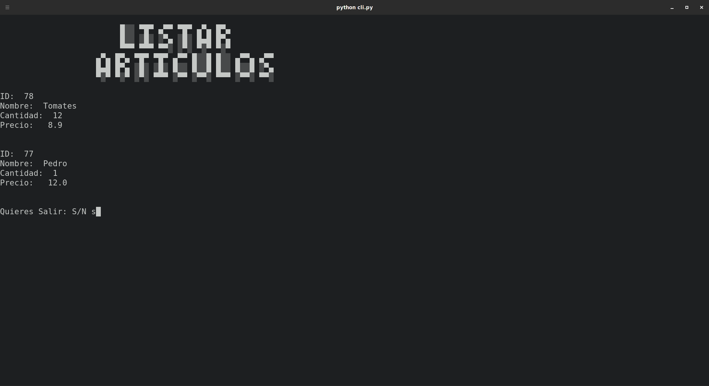

# Gestor de Productos 
## ¿Que es?


*/Actualmente esta es la versión 2.0, se han corregido la mayor parte de problemas para crear una base fuerte la cual permita añadir funcionalidades a futuro/*

Una herramienta destinada al manejo de productos y mercancía de forma sencilla y fácil, orientada a personas sin conocimientos en informática. Creada con el principal objetivo de poder utilizarse en casi cualquier dispositivo. 
Teniendo el software en tres presentaciones **CLI**,  **GUI**, **Web** y **APK**, con la finalidad de poder tener un control amplio de sus productos y mercancía.
## Forma de Uso
### CLI: 
Para usar el CLI debemos ejecutar el comando ` python3 cli.py ` Posteriormente nos pedirá que ingresemos el usuario y contraseña esto se configuro en la INSTALACIÓN por defecto tenemos que esta es "Juan" y la contraseña es "Pilancho".
Teniendo la posibilidad de realizar las siguiente opciones

 1. Listar Artículos
 2. Insertar Artículos
 3. Editar Artículos
 4. Eliminar Artículos



# Instalación
Recuerde que debe tener de forma previa configurada una Base de Datos para almacenar lo mencionado. *Para esto leer el apartado de **"Creación de la Base de Datos"***
## Importante
Si desea desarrollar o ejecutar las ultimas versiones de *Gestor de Productos*, considere lo siguiente:

Tener instalado **Python3** y **pip3** (Instalador de paquetes de Python3), instalar el conector de Python a **MariaDB** con pip3 para la conexión `pip3 install mariadb` , se esta trabajando con un servidor local, base de datos aplicación, tabla productos y usuarios.
Para desarrollar la GUI necesitas instalar **PyQt5** usando el siguiente comando `pip install PyQt5` depende si lo hacen en Windows, Linux o Mac puede que requiera hacer pasos adicionales.
## Creación de la Base de datos
Para crear la Base de datos necesitaremos MariaDB o en su defecto MySQL 4.04 en adelante. Esto se recomienda ya que se usa el cifrado AES que esta disponible desde la versión 4.04 en adelante en el gestor de Base de Datos MySQL y MariaDB, ingrese los siguientes comandos dentro de la consola de MySQL o MariaDB

### Creación de la Base de Datos
```
CREATE DATABASE aplicacion;
USE aplicacion;
```
### Creación de usuario
Hasta el momento hemos trabajado con el usuario *root* lo cual supone ciertos peligros y limitantes a la hora de trabajar con varias personas.
```
GRANT USAGE ON *.* TO 'usuario'@'%' IDENTIFIED BY 'contraseña';
```
Lo que hacemos es crear un usuario el cual va a tener acceso a la base de datos y de esta manera no usar el *root*.
```
GRANT ALL privileges ON `aplicacion`.* TO 'usuario'@'%';
```
Para terminar de guardar los cambios solo ejecutamos la siguiente linea:
```
FLUSH PRIVILEGES;
```
Ahora ya podemos iniciar MariaDB o MySQL con su nuevo usuario con el comando `mysql -u usuario -p contraseña`
### Creación de la Tabla para los usuarios
```
CREATE TABLE usuarios( id_usuario INTEGER NOT NULL, usuario VARCHAR(20) NOT NULL, clave VARCHAR(50) NOT NULL ) ENGINE= 'InnoDB' DEFAULT CHAR SET= latin1;
```

### Creación de la Tabla para los productos
```
CREATE TABLE productos( id INTEGER(11), nombre VARCHAR(30), cantidad INTEGER(11), precio FLOAT);
```
## Esquema de la Base de Datos
Base de datos= "aplicacion"
Tablas:

 - **productos**
     - **id** (INT 11)
     -  **nombre** (VARCHAR 30)
     - **cantidad** (INT 11)
     - **precio** (FLOAT)
  - **usuarios**
       - **id_usuario** (INT NOT NULL) 
       - **usuario** (VARCHAR 20 NOT NULL) 
       - **clave** (VARCHAR 50 NOT NULL)

Como debería verse las tablas creadas:
```
MariaDB [aplicacion]> DESCRIBE productos;
+----------+-------------+------+-----+---------+-------+
| Field    | Type        | Null | Key | Default | Extra |
+----------+-------------+------+-----+---------+-------+
| id       | int(11)     | YES  |     | NULL    |       |
| nombre   | varchar(30) | YES  |     | NULL    |       |
| cantidad | int(11)     | YES  |     | NULL    |       |
| precio   | float       | YES  |     | NULL    |       |
+----------+-------------+------+-----+---------+-------+

MariaDB [aplicacion]> DESCRIBE usuarios;
+------------+-------------+------+-----+---------+-------+
| Field      | Type        | Null | Key | Default | Extra |
+------------+-------------+------+-----+---------+-------+
| id_usuario | int(11)     | NO   |     | NULL    |       |
| usuario    | varchar(20) | NO   |     | NULL    |       |
| clave      | varchar(50) | NO   |     | NULL    |       |
+------------+-------------+------+-----+---------+-------+
```
## Configuración
Para configurar la conexión con base de datos debemos configurar el archivo `db_connect.py`, este archivo contiene la configuración para la base de datos, el usuario y las credenciales para acceder a la misma

    ```
    import mariadb #Este es el modulo de conexión (MariaDB)
    
    class conexion:
        #Verificacion de usuario
        def __init__(self):
            self.conn = mariadb.connect(
                user="jorge", #Aqui colocamos el usuario para la base de datos
                password="basededatos", #Contraseña para la misma
                host="localhost", #El lugar de la base de datos localhost=127.0.0.1 o alguna otra.
                database="aplicacion" #Nombre de la base de Datos a usar.
                )
    ```
# Errores

## Error (101)
El error 101 en el área de Insertar hace referencia a que en la base de datos ya existe un elemento con el mismo ID, si se quiere registrar un elemento del mismo nombre, se recomienda usar otro ID para evitar este problema
## Error (102)
El error 102 es aquel que aparece cuando se intenta eliminar un producto que no existe en la base de datos.

## Error (103)
El error 103 es aquel que ocurre cuando un elemento a actualizar no existe en la tabla de la base de datos, para solucionarlo debes crear el elemento.

## Error (104)
Este error es producido por la GUI o Interfaz gráfica, este se provoca al ocurrir un error en la inserción de datos en la tabla, debe respetar el tipo de datos que aceptan cada uno Nombre(Texto), ID(Numero Entero), Cantidad (Numero Entero), Precio(Numero Flotante o Decimal).
